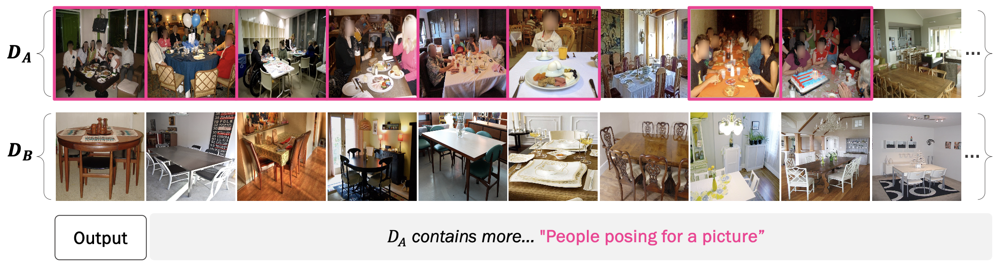

# VisDiff: Describing Differences in Image Sets with Natural Language

[](https://lbesson.mit-license.org/)
[](https://www.python.org/downloads/release/python-311/)
[](https://pytorch.org/get-started/previous-versions/#v21)
[](https://github.com/ambv/black)

This repo provides the PyTorch source code of our paper: [Describing Differences in Image Sets with Natural Language](https://arxiv.org/abs/2312.02974) (**CVPR 2024 Oral**). Check out project page [here](https://understanding-visual-datasets.github.io/VisDiff-website/)!

## 🔮 Abstract

How do two sets of images differ? Discerning set-level differences is crucial for understanding model behaviors and analyzing datasets, yet manually sifting through thousands of images is impractical. To aid in this discovery process, we explore the task of automatically describing the differences between two **sets** of images, which we term Set Difference Captioning. This task takes in image sets $\mathcal{D}_A$ and $\mathcal{D}_B$, and outputs a description that is more often true on $\mathcal{D}_A$ than $\mathcal{D}_B$. We outline a two-stage approach that first proposes candidate difference descriptions from image sets and then re-ranks the candidates by checking how well they can differentiate the two sets. We introduce VisDiff, which first captions the images and prompts a language model to propose candidate descriptions, then re-ranks these descriptions using CLIP. To evaluate VisDiff, we collect VisDiffBench, a dataset with 187 paired image sets with ground truth difference descriptions. We apply VisDiff to various domains, such as comparing datasets (e.g., ImageNet vs. ImageNetV2), comparing classification models (e.g., zero-shot CLIP vs. supervised ResNet), characterizing differences between generative models (e.g., StableDiffusionV1 and V2), and discovering what makes images memorable. Using VisDiff, we are able to find interesting and previously unknown differences in datasets and models, demonstrating its utility in revealing nuanced insights.

</img>

## 🚀 Getting Started

Here we provide a minimal example to describe the differences between two sets of images, where [set A](./data/examples/set_a/) are images showing `people practicing yoga in a mountainous setting` and [set B](./data/examples/set_b/) are images showing `people meditating in a mountainous setting`.

1. Install dependencies:
  ```bash
  pip install -r requirements.txt
  ```

2. Login [wandb](https://wandb.ai) account:
  ```bash
  wandb login
  ```

3. Describe differences:
  ```bash
  python main.py --config configs/example.yaml
  ```

After that, you should see the following results in [wandb](https://wandb.ai/yuhuiz/VisDiff/reports/VisDiff-Example--Vmlldzo2MTUzOTk4).


## 💼 Customized Usage

If you want to use VisDiff on your own datasets, you can follow the following steps.

### 1. Convert Datasets

Convert your dataset to CSV format with two required columns `path` and `group_name`. An example of the CSV files can be found in [data/examples.csv](data/Examples.csv).

### 2. Define Configs

To describe the differences between two datasets, we need a `proposer` and a `ranker`. The proposer randomly samples subsets of images to generate a set of candidate differences. The ranker then scores the salience and significance of each candidate.

We have implemented different proposers and rankers in [components/proposer.py](./components/proposer.py) and [components/ranker.py](./components/ranker.py). To use each of them, you can edit arguments in [configs/base.yaml](./configs/base.yaml).

We put all the general arguments in [configs/base.yaml](./configs/base.yaml) and dataset specific arguments in [configs/example.yaml](./configs/example.yaml).

### 3. Setup Servers

We unify all the LLMs, VLMs, and CLIP to API servers for faster inference. Follow the instructions in [serve/](./serve/README.md) to start these servers.

For example, if you use BLIP-2 + GPT-4 as proposer and CLIP as ranker, you need to start the following servers:
```bash
python serve/clip_server.py
python serve/vlm_server_blip.py 
```

### 4. Describe Differences

Finally, you can run the following command to describe the differences between two datasets:
```bash
python main.py --config configs/example.yaml
```

## 📄 Reproduce Paper Results

### 📊 VisDiffBench (Section 5 in Paper)

To evaluate our system, we collected VisDiffBench, a benchmark of 187 paired image sets with ground truth difference descriptions ([download link](https://drive.google.com/file/d/1PybUlQOesFIfgAjYlJabsyw5UHf5GOrZ/view?usp=sharing )). To evaluate performance on VisDiffBench, we ask VisDiff to output a description for each paired set and compare it to the ground truth using [GPT-4 evaluator](./components/evaluator.py).

VisDiffBench is collected from the following datasets:

- PairedImageSets ([Collection Code](./data/pairedimagesets/)) 
- [ImageNetR](https://github.com/hendrycks/imagenet-r)
- [ImageNet*](https://huggingface.co/datasets/madrylab/imagenet-star)

To evaluate VisDiff, you can run the codes in [sweeps/](./sweeps/):
```bash
python sweeps/sweep_pairedimagesets.py
python sweeps/sweep_imagenet.py
```

### 💎 Applications (Section 6 in Paper)

For each application, we provide the corresponding codes and usages in [applications](applications/) folder.

## 🎯 Citation

If you use this repo in your research, please cite it as follows:
```
@inproceedings{VisDiff,
  title={Describing Differences in Image Sets with Natural Language},
  author={Dunlap, Lisa and Zhang, Yuhui and Wang, Xiaohan and Zhong, Ruiqi and Darrell, Trevor and Steinhardt, Jacob and Gonzalez, Joseph E. and Yeung-Levy, Serena},
  booktitle={Conference on Computer Vision and Pattern Recognition (CVPR)},
  year={2024}
}
```
